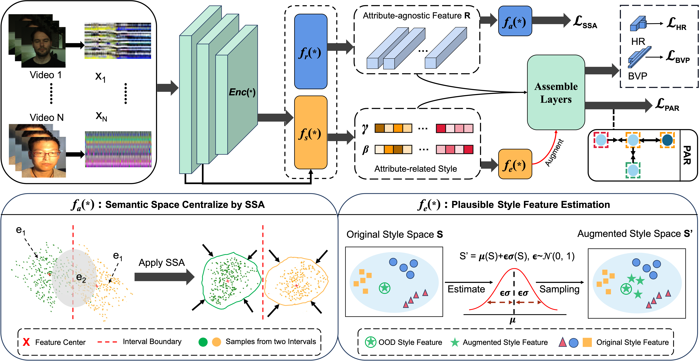

# DG-rPPG
Official code of IEEE TIM 2024 ["Generalizable Remote Physiological Measurement via Semantic-Sheltered Alignment and Plausible Style Randomization"](https://personal.hkust-gz.edu.cn/hedengbo/assets/publicationPDFs/Wang-IEEE-TIM_2024a.pdf)

<div style="text-align:center;">
  
</div>


## Data Prepare
You can refer to https://github.com/EnVision-Research/NEST-rPPG to obtain the processed STMaps.
Before that, please get the permission to use the following datasets first:
[**VIPL**](http://vipl.ict.ac.cn/en/resources/databases/201901/t20190104_34800.html),
[**V4V**](https://competitions.codalab.org/competitions/31978),
[**BUAA**](https://ieeexplore.ieee.org/document/9320298),
[**UBFC**](https://sites.google.com/view/ybenezeth/ubfcrppg), 
[**PURE**](https://www.tu-ilmenau.de/en/university/departments/department-of-computer-science-and-automation/profile/institutes-and-groups/institute-of-computer-and-systems-engineering/group-for-neuroinformatics-and-cognitive-robotics/data-sets-code/pulse-rate-detection-dataset-pure).
After getting STMaps, you can create a new './STMap' folder and put them into it.

## Pre-trained Model
In this work, we utilized the ResNet18 as the backbone network. You can download it directly from this [link](https://download.pytorch.org/models/resnet18-5c106cde.pth).
Next, create a new folder './pre_encoder' and put the pth file into it.

## Train and Test
Then, you can try to train it with the following command:

```
python train.py -g $GPU id$ -t 'the target dataset you want to test on' -tk 'the TopK sample for PAR loss' -si 'standard interval for SSA loss'
```
## Citation
```
@ARTICLE{dg2024wang,
  author={Wang, Jiyao and Lu, Hao and Han, Hu and Chen, Yingcong and He, Dengbo and Wu, Kaishun},
  journal={IEEE Transactions on Instrumentation and Measurement}, 
  title={Generalizable Remote Physiological Measurement via Semantic-Sheltered Alignment and Plausible Style Randomization}, 
  year={2024}
}

```
